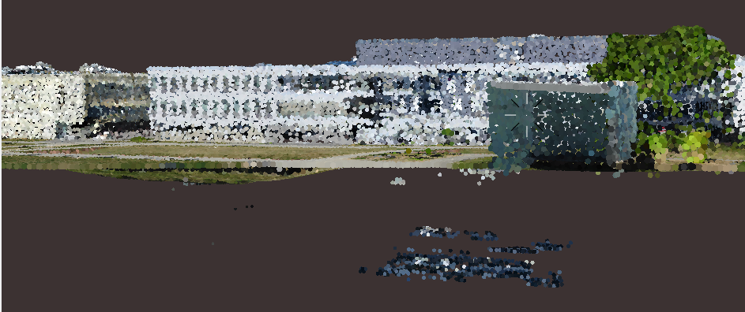
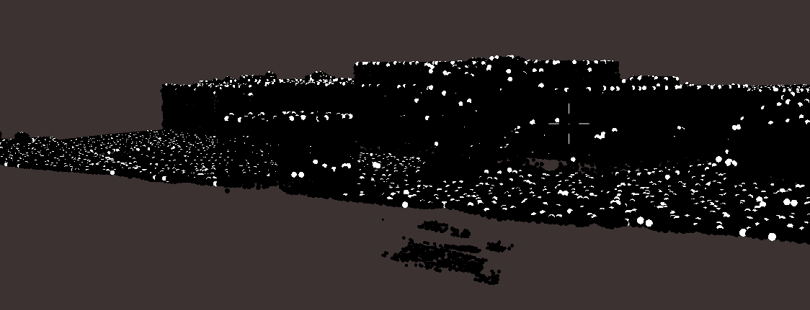
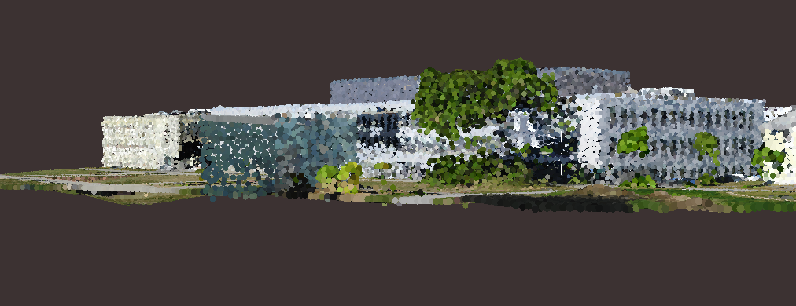
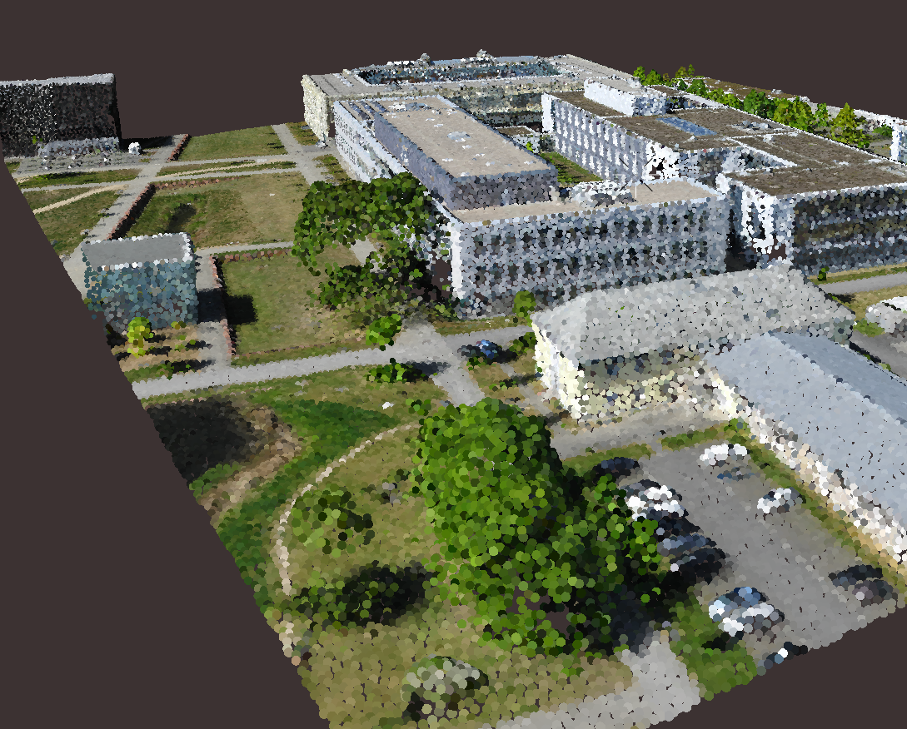
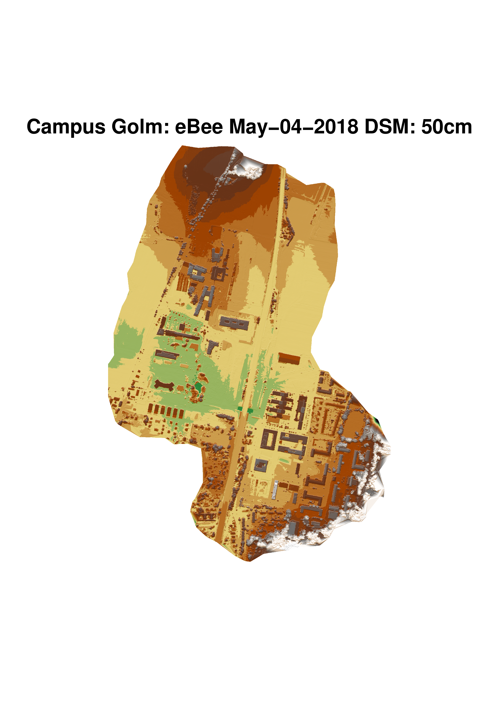
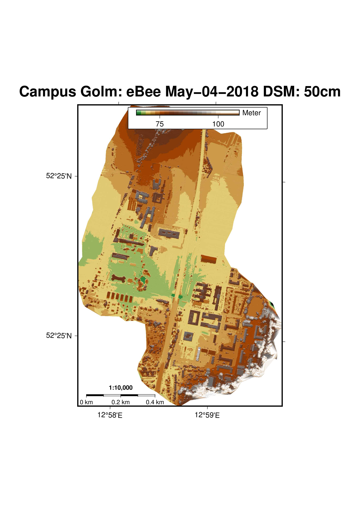
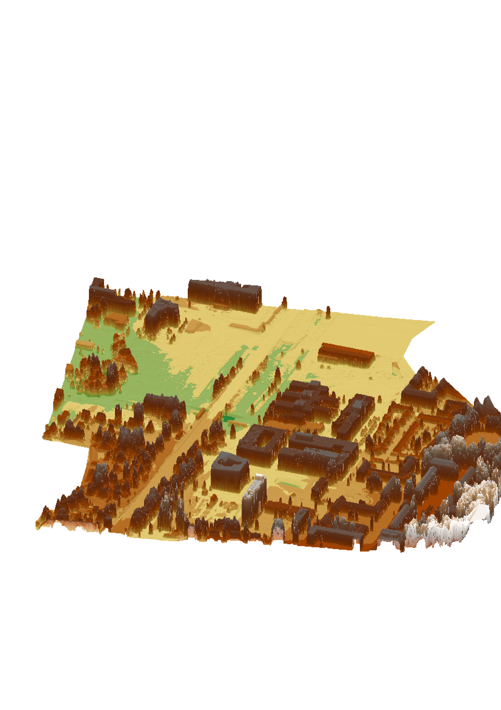

# Outline
This document-in-manual-style roughly outlines the steps necessary to take a point cloud, classify it, and display it as a map with GMT. Visualization with GMT includes 2.5D perspective views with points and meshes, but also 2D maps. Emphasis is put on open-source software (with the exception of LAStools that requires a license for full functionality). The following steps are described:

1. Preprocess and classify point-cloud data
    * including preprocessing of SfM pointclouds that are usually noisier than lidar pointclouds
2. Classifying a point cloud to generate Digital Surface Model (DSM) or Digital Terrain Model (DTM)
    * classification and DEM generation with [LAStools](https://rapidlasso.com/lastools/) and [pdal](https://pdal.io/)
3. Converting the LAZ files to properly organized shapefiles or GMT files 
    * attribute tables are converted
4. Generating map and perspective views from the gridded lidar data using GMT
5. Generating perspective views from point-cloud data

As an example dataset, we use a SfM point cloud of the University of Potsdam campus Golm collected on May-04-2018 with an [ebee Classic drone](https://www.sensefly.com/drone/ebee-mapping-drone/) using the [S.O.D.A.](https://www.sensefly.com/camera/sensefly-s-o-d-a/) camera. The Structure-from-Motion (SfM) processing was performed in [Agisoft Photoscan](http://www.agisoft.com/). Note: Agisoft will be renamed to Agisoft Metashape by the end of 2018. Flights and SfM processing was performed by Simon Riedl ([sriedl@uni-potsdam.de](sriedl@uni-potsdam.de)).

This manual assumes you are familiar with the shell and command line steps. Emphasis is put on command-line processing and automatization - each and every step could also be carried out using mouse-driven software (but likely is more cumbersome). The processing was done on an Ubuntu system, but will work on any Linux flavour and Mac OS. Windows users should also have no problems following this, but may have to install additional software for full functionality (e.g., a BASH Shell emulator: [win-bash](http://win-bash.sourceforge.net/) or [Cygwin](https://www.cygwin.com/)). Note that windows users may have to substitute `\` with `^` for achieving line breaks. 


# GMT Installation
As a general introduction, please look at [http://gmt.soest.hawaii.edu/projects/gmt/wiki/Installing](http://gmt.soest.hawaii.edu/projects/gmt/wiki/Installing). This contains many useful information. The current source code and binaries for Windows and Mac OS X Darwin can be downloaded at [http://gmt.soest.hawaii.edu/projects/gmt/wiki/Download](http://gmt.soest.hawaii.edu/projects/gmt/wiki/Download).

On Ubuntu 18.04 and above, you can install gmt and useful additions on the command line. All you need to do is:
```
sudo apt install -y subversion build-essential cmake \
    libcurl4-gnutls-dev libnetcdf-dev libgdal-dev \
    libfftw3-dev libpcre3-dev liblapack-dev libblas-dev \
    graphicsmagick texlive texlive-latex-extra python-sphinx
```
Note that there is an additional step to do for `imagemagick`. `imagemagick` is a very useful graphic file conversion tool, for example from Postscript PS to PDF, PNG, or JPG. It also allows you tile several figures on one page and prepare figures for manuscripts and publications. For more extensive options see [command-line options](https://imagemagick.org/script/command-line-options.php)

By default, imagemagick doesn't allow you to read and write from PS and PDF files for some security reason. In order to fix the convert problem (an error that includes `... not authorized`), please edit the file `/etc/ImageMick-6/policy.xml`. Change the rights setting and add `read|write`. The resulting file should include the following lines:

```
   <policy domain="coder" rights="read|write" pattern="PS" />
   <policy domain="coder" rights="read|write" pattern="PDF" />
```

**Please be aware that the Ubuntu repositories do not contain a recent GMT version. We strongly recommend to either install it via anaconda (see next section or compile it yourself (see below).**

## Installing the most recent GMT version via anaconda/miniconda
**This is - most likely - the most useful installation option to get the most recent version.**
If you are new to python or *nix derivates, I suggest to use anaconda (it's the simplest way to get GMT on your system) - not tested on Window systems yet. If you don't have anaconda/miniconda installed, I suggest you look at [miniconda](https://conda.io/docs/user-guide/install/linux.html) and then run `bash Miniconda3-latest-Linux-x86_64.sh`.


First, make sure your anaconda/miniconda path is included (you will need to adjust this, but most likely your `bin` directory already is added:
```
export PATH=/home/bodo/miniconda3/bin:$PATH
```

### GMT v5.x
**All examples included here will work with this!** 

First, make sure your anaconda/miniconda path is included (you will need to adjust this, but most likely your `bin` directory already is added:
```
export PATH=/home/bodo/miniconda3/bin:$PATH
```

If you haven't done so already, add path and create environment. Will also install python and numpy:
```
conda config --prepend channels conda-forge/label/dev
conda config --prepend channels conda-forge
conda create -y --name gmt5-python python=3.6 pip numpy pandas \
    xarray packaging ipython gdal pdal gmt=5*
```

**Start the GMT 5 environment with:**
```
source activate gmt5-python
```

### GMT v6.x
**This installs the bleeding edge of GMT: GMT 6. New features, but also some bugs. Certainly easier to use.** 

First, make sure your anaconda/miniconda path is included (you will need to adjust this, but most likely your `bin` directory already is added:
```
export PATH=/home/bodo/miniconda3/bin:$PATH
```

Install the gmt6 environment. Will also install python and numpy:
```
conda config --prepend channels conda-forge/label/dev
conda config --prepend channels conda-forge
conda create -y --name gmt6-python python=3.6 pip numpy pandas \
    xarray packaging ipython gdal pdal gmt=6.0.0*
```

**Start the GMT 6 environment with:**
```
source activate gmt6-python
```


## Compilation of source codes
### Compiling GMT 5.x from sources
For some other Unix derivates or if you want to have full compatibility and control, you may want to compile the sources. This is straight forward - please see below for an example on Linux derivates. In the following, we install GMT into `/usr/local/gmt`. 

```
#First, download shapefiles and dcw
cd /usr/local
sudo mkdir gmt
```

I like to change the directory to be readable by the normal user, here bodo.bodo:
```
sudo chown bodo.bodo -R gmt
```


Next, download the files, including the gshhg and dcw data. You may want to check the versions, there is an update every few months:
```
cd /usr/local/gmt
mkdir gshhg
cd /usr/local/gmt/gshhg
wget ftp://ftp.soest.hawaii.edu/gshhg/gshhg-bin-2.3.7.zip
wget ftp://ftp.soest.hawaii.edu/gshhg/gshhg-gmt-2.3.7.tar.gz
wget ftp://ftp.soest.hawaii.edu/gshhg/gshhg-shp-2.3.7.zip
mkdir /usr/local/gmt/dcw
cd /usr/local/gmt/dcw
wget ftp://ftp.soest.hawaii.edu/dcw/dcw-gmt-1.1.3.tar.gz

```

The code is compiled in /usr/local/src and then installed to /usr/local/gmt:

```
cd /usr/local/src
sudo cp /raid-cachi/bodo/Dropbox/soft/gmt-5.4.4-src.tar.gz .
sudo tar zxvf gmt-5.4.4-src.tar.gz
```

Again, change the directory owner
```
sudo chown bodo.bodo -R gmt-5.4.4
```

And continue with the compilation process:
```
cd gmt-5.4.4
#If you have anaconda/miniconda, make sure to remove that path 
#from the PATH variable (i.e. the PATH is not set to anaconda):
export PATH=/bin:/usr/local/gmt/bin:/usr/local/sbin:/usr/local/bin:\
    /usr/sbin:/usr/bin:/sbin:/bin:/usr/games:/usr/local/games

cp cmake/ConfigUserTemplate.cmake cmake/ConfigUser.cmake
echo "set (CMAKE_INSTALL_PREFIX /usr/local/gmt)" >> cmake/ConfigUser.cmake
echo "set (GSHHG_ROOT /usr/local/gmt/gshhg)" >> cmake/ConfigUser.cmake
echo "set (DCW_ROOT /usr/local/gmt/dcw)" >> cmake/ConfigUser.cmake
echo "set (GDAL_ROOT /usr/local/bin/gdal-config)" >> cmake/ConfigUser.cmake
mkdir build
cd build
unset LD_LIBRARY_PATH
cmake -DCMAKE_INSTALL_PREFIX=/usr/local/gmt -DCMAKE_BUILD_TYPE=RelWithDebInfo ..
make -j
make -j docs_man
make -j docs_html
make -j docs_pdf
sudo make install
```

The `make -j` indicates to use as many cores as are available. You can also set it explicitly, for example to `-j 4` to use only 4 cores.

If you are interested in using [gdal](https://www.gdal.org/index.html) (and you should!), you can either use the above approach with conda or install gdal via the command line with: 
```
sudo apt-get -y install gdal-bin gdal-dev
```
**Note that for this manual, a working version of gdal is required for some commands**


### Compiling GMT 6.x and the most recent developer editions
Likely, it is easiest to install the most recent version from the github repository at [https://github.com/GenericMappingTools/gmt](https://github.com/GenericMappingTools/gmt). There are detailed instruction on how to install GMT. On modern scientific Ubuntu/Linux systems, most of the required packages are installed. Follow these steps to get the most recent GMT version installed. The build process is very similar to the one described above for GMT 5.x. Note that we are installing this into `/usr/local/gmt6`. This will allow you to have two versions (v5.x and v6.x installed simultaneously).
```
cd /usr/local/src
sudo git clone https://github.com/GenericMappingTools/gmt
sudo chown -R bodo.bodo gmt
cd gmt
cp cmake/ConfigUserTemplate.cmake cmake/ConfigUser.cmake
echo "set (CMAKE_INSTALL_PREFIX /usr/local/gmt6)" >> cmake/ConfigUser.cmake
echo "set (GSHHG_ROOT /usr/local/gmt/gshhg)" >> cmake/ConfigUser.cmake
echo "set (DCW_ROOT /usr/local/gmt/dcw)" >> cmake/ConfigUser.cmake
echo "set (GDAL_ROOT /usr/local/bin/gdal-config)" >> cmake/ConfigUser.cmake

mkdir build
cd build
cmake -DCMAKE_INSTALL_PREFIX=/usr/local -DCMAKE_BUILD_TYPE=RelWithDebInfo ..
make -j
sudo make -j install
```

If you are interested in using [gdal](https://www.gdal.org/index.html) (and you should!), you can either use the above approach with conda or install gdal via the command line with: 
```
sudo apt-get -y install gdal-bin gdal-dev
```
**Note that for this manual, a working version of gdal is required for some commands**

### Installing GMT for Python from GitHub
If you are interested in generating figures and maps directly from numpy arrays, you may want to look into [gmt-python](https://github.com/GenericMappingTools/gmt-python). Please follow the steps described on their webpage or look here [https://www.gmtpython.xyz/latest/install.html](https://www.gmtpython.xyz/latest/install.html). If you are new to python or *nix derivates, I suggest to use anaconda (it's the simplest way to get GMT on your system) - not tested on Window systems yet. If you don't have anaconda/miniconda installed, I suggest you look at [miniconda](https://conda.io/docs/user-guide/install/linux.html) and then run `bash Miniconda3-latest-Linux-x86_64.sh`.


First, make sure your anaconda/miniconda path is included (you will need to adjust this, but most likely your `bin` directory already is added:
```
export PATH=/home/bodo/miniconda3/bin:$PATH
```

Then continue with installation. If you already have installed the `gmt6-python` environment as shown above, you can skip this step:
```
conda config --prepend channels conda-forge/label/dev
conda config --prepend channels conda-forge
conda create -y --name gmt6-python python=3.6 pip numpy pandas \
    xarray packaging ipython gmt=6.0.0*
```


**If you have the gmt6-python environment working**, GMT-Python installation commands are as follows (bash shell on Ubuntu, should work on Mac OS X as well). After setting up the miniconda/anaconda environment, you activate the environment and install gmt-python:
```
source activate gmt6-python
pip install \
    https://github.com/GenericMappingTools/gmt-python/archive/master.zip
```

Alternatively, you can download the source code from the github webpage and install it:

```
cd /usr/local/src
sudo git clone https://github.com/GenericMappingTools/gmt-python
sudo chown -R bodo.bodo gmt-python
cd gmt-python
pip install .
```

# Preprocess and classify point-cloud data
## Generating a subset from an existing point cloud
In this example, we will be working with a subset of the entire Campus Golm point cloud. There are different ways to extract subsets of points - most of them involve creating a shapefile or some other polygon. One could also manually clip the point cloud using for example [CloudCompare](https://www.danielgm.net/cc/) or similar software. Here are some simple steps to generate a shapefile or GMT file if you know the coordinates (could also be generated in [QGIS](https://www.qgis.org/en/site/)). We will first generate a polygon clip on the command line where we need to know the corner coordinates.

Our example uses UTM coordinates (UTM Zone 33 north with datum WGS84) - the coordinate system of the Campus Golm in Potsdam, Germany. We know the bounding box (xmin/xmax/ymin/ymax: `-R362150/362400/5808400/5808600`), projection ([EPSG code 32633](http://spatialreference.org/ref/epsg/32633/)), and corner coordinates. We add these information to a text file using the bash terminal and command `printf`:
```
printf '# @VGMT1.0 @GPOLYGON
# @-R362150/362400/5808400/5808600
# @Je32633
# @Jp"+proj=utm +zone=33 +datum=WGS84 +units=m +no_defs "
# @Jw"PROJCS["WGS 84 / UTM zone 33N", GEOGCS["WGS 84",DATUM
["WGS_1984",SPHEROID["WGS 84",6378137,298.257223563,AUTHORITY
["EPSG","7030"]],AUTHORITY["EPSG","6326"]],PRIMEM["Greenwich",0],
UNIT["degree",0.0174532925199433],AUTHORITY["EPSG","4326"]],
PROJECTION["Transverse_Mercator"],PARAMETER["latitude_of_origin",0],
PARAMETER["central_meridian",15],PARAMETER["scale_factor",0.9996],
PARAMETER["false_easting",500000],PARAMETER["false_northing",0],
UNIT["metre",1,AUTHORITY["EPSG","9001"]],AUTHORITY["EPSG","32633"]]"
# FEATURE_DATA
362150 5808400
362400 5808400
362400 5808600
362400 5808600
362150 5808600
362150 5808400
' > Haus27_29_coordinates_UTM33N_WGS84.gmt
```
This may look cryptic and cumbersome to you, but this method is highly flexible. The PROJCS string for example can be generated from `gdalsrsinfo epsg:32633`. 

Next, this gmt file can be converted  to a shapefile using `ogr2ogr`:
```
ogr2ogr Golm_H27_H29_clip_UTM33N_WGS84.shp \
    Golm_H27_H29_clip_UTM33N_WGS84.gmt
```

Now, this shapefile can be used as input into [lasclip](https://rapidlasso.com/lastools/lasclip/) (see [lascclip Readme](http://www.cs.unc.edu/~isenburg/lastools/download/lasclip_README.txt)):
```
wine /opt/LAStools/bin/lasclip.exe \
    -poly Golm_H27_H29_clip_UTM33N_WGS84.shp \
    -i sodaall_1stproc_densecloud_wgs84_UTM33N.laz \
    -olaz -o  Golm_H27_29.laz
```
Note, here I am running lasclip through the [wine emulator](https://www.winehq.org/) on the Ubuntu command line. If you run this on a native Windows OS system, you will only need lasclip.exe (assuming you have set the proper path). The input pointcloud is `sodaall_1stproc_densecloud_wgs84_UTM33N.laz` that is not provided for this tutorial (because it's 1.2 GB large with 120'414'200 points).

We will continue to work with `Golm_H27_29.laz` in the rest of this tutorial. This file is also provided on the github page.

## Resample point cloud for faster processing
In order to keep files small on github, I have resampled the point cloud to 50cm spatial resolution. The original point cloud clipped in the previous step had 5'849'966 points. We are going to subsample this to 50-cm spatial resolution to keep files nice and small. You may want to work with a denser pointcloud, but there is a file-size limit on github. There are different ways of subsampling or thinning point clouds: [lasthin](https://rapidlasso.com/lastools/lasthin/) is one option, but this thins with a XY-grid and doesn't preserve the 3D structure of the point cloud. pdal has options to do that. Here, we are using [CloudCompare](https://www.danielgm.net/cc/) , because it's fast and provides a flexible interface. Using the function  Edit->Subsample and use a spacing of 0.5m (50cm). Note that for some CloudCompare versions on Ubuntu you may need to convert the LAZ file to LAS with:
```
wine /opt/LAStools/bin/las2las.exe \
    -i Golm_H27_29.laz \
    -olas -o Golm_H27_29.las. 
```

Save the resampled point cloud to `Golm_H27_29_50cm.laz` and we will continue to work with this resampled point cloud (it now has 207'164 points). You can visualize the point cloud with [displaz](https://github.com/c42f/displaz): `displaz Golm_H27_29_50cm.laz`

## Pre-process and filter the SfM point cloud 
When you visually inspect the point cloud, you will note that there are several erroneous points below the surface (Figure \ref{Fig:H27_sideview})

 

This is a typical problem with SfM data and the dense matching algorithm. There are several options in AgiSoft Photoscan that may prevent these mismatches from ocurring, but this often requires reprocessing the entire dataset and most often will result in an overall less dense point cloud. Here we use the dense point cloud and filter it using some steps taken from [https://rapidlasso.com/category/photogrammetry/](https://rapidlasso.com/category/photogrammetry/).


First, thin the data with a 2.5m grid and mark the highest points per 2.5m as class 8:
```
wine /opt/LAStools/bin/lasthin.exe \
    -i Golm_H27_29_50cm.laz \
    -step 2.5 -highest -classify_as 8 \
    -olaz \
    -o Golm_H27_29_50cm_thinned.laz
```

You can verify the output with 
```
displaz Golm_H27_29_50cm_thinned.laz
```
and using Colour Mode: Las Classification (Figure \ref{Fig:H27_sideview_thinned}).




Second, identify noise from all points *except* class 8 points. This sets less than 4 points within a 5x5 m (X-Y plane) and 0.1 m (Z plane) neighborhood as noise (class 7) and writes a new LAZ file: 
```
wine /opt/LAStools/bin/lasnoise.exe \
    -i Golm_H27_29_50cm_thinned.laz \
    -ignore_class 0 -step_xy 5 -step_z 0.1 -isolated 4 -classify_as 7 \
    -olaz \
    -o Golm_H27_29_50cm_thinned_isolated.laz
```


Third, you derive a temporary ground classification of the heavily thinned and noise-free point cloud `Golm_H27_29_50cm_thinned_isolated.laz`. This is used as a reference surface to mark points below the resulting TIN. These are usually points resulting from errenous SfM matching or reflections: (The options `-ultra_fine` marks a very small step size, because we work with a dense point cloud, `-city` indicates the step spacing, and we tell [lasground](https://rapidlasso.com/lastools/lasground/) to ignore class 0 and the noise class 7):

```
wine /opt/LAStools/bin/lasground.exe \
    -i Golm_H27_29_50cm_thinned_isolated.laz \
    -city -ultra_fine -ignore_class 0 7 \
    -olaz \
    -o Golm_H27_29_50cm_thinned_isolated_temp_ground.laz 
```

Fourth, get the height of points from the ground-classified surface. The ground-classified surface is interpolated as a TIN and the height of every non-ground point is determined and every point that is below 1m of the TIN surface is classified as class 12. You can change and adjust this height thresold by changing the option `-classify_below -1 12`. For example, setting this to `-classify_below -0.5 12` indicates that points 0.5m below the TIN surface are removed - this would be tighter constrain.

```
wine /opt/LAStools/bin/lasheight \
    -i Golm_H27_29_50cm_thinned_isolated_temp_ground.laz \
    -do_not_store_in_user_data -classify_below -1 12 \
    -olaz \
    -o Golm_H27_29_50cm_thinned_isolated_temp_ground_denoised
```

Fifth, we re-arrange the classes and move all points from the previous step that were below the TIN-ground surface (class 12) into the noise class 7:
```
wine /opt/LAStools/bin/las2las.exe \
    -i Golm_H27_29_50cm_thinned_isolated_temp_ground_denoised.laz \
    -change_classification_from_to 1 0 \
    -change_classification_from_to 2 0 \
    -change_classification_from_to 7 0 \
    -change_classification_from_to 12 7 \
    -olaz \
    -o Golm_H27_29_50cm_thinned_isolated_temp_ground_denoised_cl.laz
```        

The resulting denoised point cloud can be used for further processing. You can remove the noise points from the LAZ file with las2las and the option `drop_class`:
```
wine /opt/LAStools/bin/las2las.exe \
    -i Golm_H27_29_50cm_thinned_isolated_temp_ground_denoised_cl.laz \
    -drop_class 7 -olaz -o Golm_H27_29_50cm_nonoise.laz
```
This point cloud does not contain any subsurface points and can be used for further processing (Figure \ref{Fig:H27_sideview_nonoise}).



However, you can also just ignore class 7 in the next processing steps - there is no need to generate a separated, no-noise LAZ file (but it's nice to have).


## Perform a ground classification of the denoised point cloud: lasground
Now we can perform a ground classification ignoring the noise points (class 7):
```
wine /opt/LAStools/bin/lasground.exe -ignore_class 7 -compute_height \
    -ultra_fine -step 50 -olaz \
    -i Golm_H27_29_50cm_thinned_isolated_temp_ground_denoised_cl.laz \
    -o Golm_H27_29_50cm_g.laz
```
Alternatively, you could use the no-noise LAZ file:
```
wine /opt/LAStools/bin/lasground.exe -compute_height -ultra_fine \
    -step 50 -olaz \
    -i Golm_H27_29_50cm_nonoise.laz \
    -o Golm_H27_29_50cm_g.laz
```

## Perform a ground classification of the denoised point cloud: pdal and SMRF
Instead of using [lasground](https://rapidlasso.com/lastools/lasground/), you can rely on the [SMRF filter](https://pdal.io/stages/filters.smrf.html) implemented in pdal. The Simple Morphological Filter is described in scientific publications and works well for SfM pointclouds. In the following example, we also ignore the previously identified noise points (so we could also use Golm_H27_29_50cm_thinned_isolated_temp_ground_denoised_cl.laz as an input file):

```
pdal translate Golm_H27_29_50cm_nonoise.laz \
-o Golm_H27_29_50cm_nonoise_g_smrf.laz \
outlier smrf range \
--filters.smrf.ignore="Classification[7:7]" \
--filters.smrf.window=100 \
--filters.range.limits="Classification[0:7]" \
--writers.las.compression=true -v 4
```

Note that for this example, I have simply used the PDAL version that comes with the anaconda distribution and I have used `conda install -c conda-forge pdal` to install pdal.

For additional options of the SMRF filter, please look at the [SMRF filter implementation](https://pdal.io/stages/filters.smrf.html). If you  would like to create a file only containing the ground points, use `--filters.range.limits="Classification[2:2]"`.

You can do some statistical outlier filtering before performing the classification:

```
pdal translate Golm_H27_29_50cm.laz \
    -o Golm_H27_29_50cm_g_smrf.laz \
    outlier smrf range \
    --filters.outlier.method="statistical" \
    --filters.outlier.mean_k=10 \
    --filters.outlier.multiplier=2.0 \
    --filters.smrf.ignore="Classification[7:7]" \
    --filters.smrf.window=100 \
    --filters.range.limits="Classification[0:7]" \
    --writers.las.compression=true -v 4
```
However, you will not achieve the same results as the lasthin approach described above that explicitly removes points below a ground-classified surface. These steps can be performed pdal as well but are more extensive and not described in this approach. Also, the classification of vegetation and buildings (see next step) is possible in pdal, but requires additional steps and fine tuning that is not described in this manual.

## Perform a ground classification of the denoised point cloud: pdal and SMRF
Next, we generated vegetation and building classes using [lasclassify](https://rapidlasso.com/lastools/lasclassify/) with a curvature-based classification approach:
```
wine /opt/LAStools/bin/lasclassify.exe \
    -i Golm_H27_29_50cm_g.laz \
    -olaz -o Golm_H27_29_50cm_gc.laz
```

This completes our pre-processing and classification steps with the final point cloud (Figure \ref{Fig:H27_classified}).


The RGB image shows the color information stored in the RGB attributes (Figure \ref{Fig:H27_RGB})




## Grid the classified point cloud to a DSM (Digital Surface Model) and DTM (Digital Terrain Model)
As a next step, you can create a gridded DTM of the data using the classified ground points from class 2 carried out in the previous steps (note that we interpolate this to 1m here):
```
wine /opt/LAStools/bin/blast2dem.exe -keep_class 2 \
    -utm 33U -ellipsoid 11 -meter -elevation_meter \
    -step 1 \
    -i Golm_H27_29_50cm_gc.laz \
    -o Golm_H27_29_50cm_gc_1m_DTM.tif
```

In addition, we can interpolate points to create a DSM:
```
wine /opt/LAStools/bin/blast2dem.exe \
    -keep_class 0 2 3 4 5 6 -utm 33U -ellipsoid 11 \
    -meter -elevation_meter -step 1 \
    -i Golm_H27_29_50cm_gc.laz \
    -o Golm_H27_29_50cm_gc_1m_DSM.tif
```
This is often done with [lasgrid](https://rapidlasso.com/lastools/lasgrid/) which is more appropriate for this, because it allows you to chose the maximum height for a given grid cell.

## Additional information
We now have created a classified point cloud and two gridded surfaces (DSM and DTM). If you want to obtain additional information about the classified point cloud, you can use lasinfo, for example to derive the point density:"
```
wine /opt/LAStools/bin/lasinfo.exe \
    -nh -nv -nmm -cd -i Golm_H27_29_50cm_gc.laz
```
With the following output:
```
lasinfo (180831) report for 'Golm_H27_29_50cm_gc.laz'
number of first returns:        207164
number of intermediate returns: 0
number of last returns:         207164
number of single returns:       207164
covered area in square units/kilounits: 50000/0.05
point density: all returns 4.14 last only 4.14 (per square units)
spacing: all returns 0.49 last only 0.49 (in units)
```

# Convert a LAZ file ASCII/Shapefile/GMT
The LAZ/LAS file format is not directly readable by various GIS softwares. There exist readers and converters in several GIS software suites (e.g., the commercial GIS suite [ArcMap](http://desktop.arcgis.com/en/arcmap/) or the open-source project [QGIS](https://www.qgis.org/en/site/)), but here we will use a command line approach to have the largest flexibility.

First, convert the LAZ file to an ASCII file using the open-source [las2las](https://rapidlasso.com/lastools/las2las/) with a helpful [README](http://www.cs.unc.edu/~isenburg/lastools/download/las2las_README.txt). Note that we scale the 16-bit RGB values to 8-bit RGB values with `-scale_RGB_down` and that we remove the noise points (`-drop_class 7`):
```
wine /opt/LAStools/bin/las2las.exe \
    -scale_RGB_down -drop_class 7 \
    -i Golm_H27_29_50cm_gc.laz \
    -oparse xyzcRGB \
    -o Golm_H27_29_50cm_gc_XYZcRGB.csv
```
We write the columns X, Y, Z, class (c), and the color information (RGB).

**The csv file can be read directly from GMT, but we continue to modify it convert the file to shapefile and GMT format.**

Next, we add a header to the csv file and replace all spaces with commas. We use the linux command `sed` for this:
```
sed -i '1s/^/X,Y,Z,c,R,G,B\n/' \
    Golm_H27_29_50cm_gc_XYZcRGB.csv
sed -i 's/ /,/g' \
    Golm_H27_29_50cm_gc_XYZcRGB.csv
```

In order to read this by GIS software, we need to define a control file. These are VRT files that contain information about projection and columns. Here, we only define what columns contain the spatial information and what format (string, double, integer) the columns will have when written to shapefile attributes. You could also add projection information here, but we do that later on the command line.

Create a file called Golm_H27_29_50cm_gc_XYZcRGB.vrt with content:
```
<OGRVRTDataSource>
    <OGRVRTLayer name="Golm_H27_29_50cm_gc_XYZcRGB">
        <SrcDataSource>Golm_H27_29_50cm_gc_XYZcRGB.csv</SrcDataSource>
        <GeometryType>wkbPoint</GeometryType>
        <GeometryField encoding="PointFromColumns" x="X" y="Y" z="Z"/>
        <Field name="X" type="Real" width="8" precision="3"/>
        <Field name="Y" type="Real" width="8" precision="3"/>
        <Field name="Z" type="Real" width="8" precision="3"/>
        <Field name="c" type="Integer" width="3"/>
        <Field name="R" type="Integer" width="3"/>
        <Field name="G" type="Integer" width="3"/>
        <Field name="B" type="Integer" width="3"/>
    </OGRVRTLayer>
</OGRVRTDataSource>
```

Now, we can convert the csv file to any GIS format. We use `ogr2ogr` for this. For example, converting it to a shapefile format:
```
ogr2ogr -oo KEEP_GEOM_COLUMNS=NO -oo GEOMETRY=AS_XYZ \
    -oo SEPARATOR=COMMA -oo AUTODETECT_WIDTH=YES \
    -oo HEADERS=AUTO -oo AUTODETECT_SIZE_LIMIT=0 \
    -oo AUTODETECT_TYPE=YES \
    -t_srs epsg:32633 -s_srs epsg:32633 \
    Golm_H27_29_50cm_gc_XYZcRGB.shp \
    Golm_H27_29_50cm_gc_XYZcRGB.vrt
```

Note that we define several options on the command line. These are helpful for some awkward formats. We also define the input and output projection information through the EPSG code (`-t_srs epsg:32633 -s_srs epsg:32633`)

If you plan to convert this to a GMT file, use the ending `.gmt` instead of `.shp`. As a sanity check, you want to look at at the first ~10 lines of the GMT file to ensure that the attributes have been properly converted with
`head Golm_H27_29_50cm_gc_XYZcRGB.gmt`:
Here, you should see the line 

`# @Tdouble|double|double|integer|integer|integer|integer` 
that indicates that all attributes have been properly read from the csv file. The data or feature_data are stored in the row preceeding the point X Y Z information.


# Create high-resolution perspective 3D views using GMT
**Note: For 3D plotting of point clouds, I strongly advise to use GMT6 (see installation). The graphic interface has been vastly improved in GMT6 and points are rendered in better fashion. Before running the following, you should activate your GMT6 environment with: `source activate gmt6-python`**


We now have a GMT point file `Golm_H27_29_50cm_gc_XYZcRGB.csv` that we can display as a 3D plot in GMT. The following are a few simple lines that generate a 3D oblique view of the point cloud using [plot3d](http://gmt.soest.hawaii.edu/doc/latest/plot3d.html). (The equivalent in GMT5 is [ps_xyz](http://gmt.soest.hawaii.edu/doc/5.3.2/psxyz.html), but that is not that flexible). 

First, plot all points of building 27 and 29 in black colors:
```
FN0=ebee_Golm_H27_04May2018_50cm_plot3d_black
gmt plot3d Golm_H27_29_soda_04May2018_UTM33N_WGS84_50cm_gc_XYZcRGB.csv -p165/40 -Sc0.01 -JX8c -JZ3c -R362150/362400/5808400/5808600/65/85 -Xc -Yc -png $FN0
```
We first define an output filename FN0 and then call `gmt plot3d` on the file Golm_H27_29_soda_04May2018_UTM33N_WGS84_50cm_gc_XYZcRGB.csv. We set the perspective view with from the south with an elevation angle of 40° (`-p165/40`), define circle points with sizes of 0.01 (`-Sc0.01`), define the x and y axes to be 8cm long with `-JX8c`, and the z axis to be 3cm high with `-JZ3c`, and give the region to plot (`-R362150/362400/5808400/5808600/65/85`) and center the image in X and Y direction `-Xc -Yc`. Because we are using GMT6, we can plot directly to a PNG file called ebee_Golm_H27_04May2018_50cm_plot3d_black.png (see Figure \ref{Fig:ebee_Golm_H27_04May2018_50cm_plot3d_black}). Alternatively, we could generate a PDF file with `-pdf`.


But we would like to add colors to these points. For example, we can color the points by their elevation. In order to do this, we will need to filter the input csv file and extract the columns X, Y, Z, and add the color information into the fourth column. [gmt select](http://gmt.soest.hawaii.edu/doc/latest/gmtselect.html) allows to perform table operations and we can just tell gmt select to extract the X, Y, Z columns (col 0-2) and add the Z elevation (col 2) again:
```
gmt select -i0:2,2 Golm_H27_29_soda_04May2018_UTM33N_WGS84_50cm_gc_XYZcRGB.csv
```

This output is fed into `gmt plot3d`. We also will need to define a colorscale with `gmt makecpt` to assign colors to the elevation values. Here we use the plasma colorscale. The code snippet is:
```
FN1=ebee_Golm_H27_04May2018_50cm_plot3d_elevation
DEM_CPT=plasma_color.cpt
gmt makecpt -D -T65/85/1 -Cplasma >$DEM_CPT
TITLE='Haus 27 and 29 - Elevation'
gmt select -i0:2,2 Golm_H27_29_soda_04May2018_UTM33N_WGS84_50cm_gc_XYZcRGB.csv | gmt plot3d -p165/40 -Sc0.02 -C$DEM_CPT -JX8 -JZ3 -R362150/362400/5808400/5808600/65/85 -Xc -Yc -png $FN1
```


The output figure contains an oblique view of building 27 and 29 with points colored by their elevation (Figure \ref{Fig:ebee_Golm_H27_04May2018_50cm_plot3d_elevation}).

Next, we can also show the point cloud with colors from the classification (see previous section). We have to define a colorscale (`categorical`) and use column 3 to display colors. Here we use the option `-a3` to identify the third column to be the column containing the integer class (columns start counting at 0 with X coordinates, followed by column 1 with Y coordinates).

```
FN2=ebee_Golm_H27_04May2018_50cm_plot3d_class
CLASS_CPT=cl_color.cpt
gmt makecpt -N -T0/8/1 -Ccategorical >$CLASS_CPT
TITLE='Haus 27 and 29 - Classified PC'
gmt plot3d -p165/40 -Sc0.02 -a3 -C$CLASS_CPT Golm_H27_29_soda_04May2018_UTM33N_WGS84_50cm_gc_XYZcRGB.csv -JX8 -JZ3 -R362150/362400/5808400/5808600/65/85 -Xc -Yc -png $FN2
```


The output figure (Figure \ref{Fig:ebee_Golm_H27_04May2018_50cm_plot3d_class}) show the classified point cloud. We could add a labelled colorbar that points out colors and classes.


**STILL NEED TO DO: Using Colors stored in columns 4-5 (RGB):**
```
FN3=ebee_Golm_H27_04May2018_50cm_psxyz_RGB
TITLE='Haus 27 and 29 - RGB'
gmt select -i0:2,4:6 Golm_H27_29_soda_04May2018_UTM33N_WGS84_50cm_gc_XYZcRGB.csv | gmt plot3d -p165/40 -Sc0.04 -JX8 -JZ3 -R362150/362400/5808400/5808600/65/85 -Xc -Yc -png $FN3
```

## GMT and Colorscales
In GMT, you can use either pre-define colorscales (see [color scales](http://geophysics.eas.gatech.edu/classes/Intro_GMT/gmt_www/gmt/doc/html/GMT_Docs/node187.html), but you can also dfine your own. In addition, there exist excellent resources that allow you to use pre-made colorscale. A good place to look for a variety of unique and fancy colorscale is [cpt-city](http://soliton.vm.bytemark.co.uk/pub/cpt-city/). There also exist on [online conversion tool](http://soliton.vm.bytemark.co.uk/pub/cptutils-online/select.html) that allows you to convert colorscale online. If you intend to work with many custom-made colorscales from different source, you should look into [cptutils](http://soliton.vm.bytemark.co.uk/pub/jjg/en/code/cptutils/).

A good selection of colormaps are the [Environmental Science Colormaps](https://www.giss.nasa.gov/tools/panoply/colorbars/) that will need to be converted to GMT cpt format.
A short python code that read Adobe colormaps and outputs these as csv file (to be further converted into GMT colormaps) is shown as follows:
```
#!/usr/bin/env python2
# -*- coding: utf-8 -*-
"""
Created on Mon Nov 26 13:18:52 2018

@author: bodo
"""
# Taken from: https://graphicdesign.stackexchange.com/questions/90809/ \
# export-adobe-photoshop-color-table-act-file-as-csv-file
# act2csv.py quick script no warranties whatsoever
import struct
import csv

DATA = []

with open("NEO_div_vegetation_a.act", "rb") as actFile:
    for _ in range(256):
        raw = actFile.read(3)
        color = struct.unpack("3B", raw)
        DATA.append(color)

with open('test.csv', 'wb') as csvfile:
    csvWriter = csv.writer(csvfile)
    csvWriter.writerows(DATA)

#Will need to be modified to write as CPT file with cpt header
```

# Create high-resolution map views using GMT
**The following sections work with either GMT5 or GMT6.**
Alternatively, you can use the gridded data (DTM/DSM) and visualize these as maps or 2.5D perspective views. Here we use an example for the entire campus at 50 cm grid spacing. Note that this section only works with a 50 cm (0.5 m) DSM and an orthophoto resampled to 50 cm.

We first generate a hillshade  or gradient image of the DSM using [gmt grdgradient](http://gmt.soest.hawaii.edu/doc/5.4.4/grdgradient.html?highlight=grdgradient). We define the shell variable DEM_GRD and DEM_GRD_HS

```
DEM_GRD=sodaall_1stproc_densecloud_wgs84_UTM33N_50cm_DSM_aligned.nc
DEM_GRD_HS=${DEM_GRD::-3}_HS.nc
gmt grdgradient $DEM_GRD -A315/45 -Nt0.6 -G$DEM_GRD_HS
```

There exist large flexibility with custom-made colorscales. For our purposes, we just generate a simple colorscale for a given elevation range using the existing dem colorscale in GMT: We define output filename and colorscale ([gmt makecpt](http://gmt.soest.hawaii.edu/doc/5.4.4/makecpt.html)) with bash variables:
```
POSTSCRIPT1=ebee_Golm_04May2018_DSM_50cm.ps
DEM_CPT=dem2_color.cpt
gmt makecpt -N -T65/110/2 -Cdem2 >$DEM_CPT
```

## Generate a simple overview map
The actual plotting of the file with intensity hillshading is done with [gmt grdimage](http://gmt.soest.hawaii.edu/doc/5.4.4/grdimage.html). Here, we use option -E300 to limit output resolution to 300dpi. Remove this option if you want to produce high-resolution (and print-ready figures - but these will take longer to calculate). The `convert` command converts to output to a 300 dpi PNG file:

```
gmt grdimage $DEM_GRD -I$DEM_GRD_HS -Jx1:10000 -C$DEM_CPT -R$DEM_GRD -Q -B+t"Campus Golm: eBee May-04-2018 DSM: 50cm" -Xc -Yc -E300 >$POSTSCRIPT1
convert -quality 100 -density 300 $POSTSCRIPT1 ${POSTSCRIPT1::-3}.png

```



Alternative to convert (e.g., if you don't have imagemagick installed, use [gmt psconvert](http://gmt.soest.hawaii.edu/doc/5.4.4/psconvert.html?highlight=psconvert) that also allows to write to PNG (option `-TG`), here we create a PDF (option `-Tf`):
```
gmt psconvert $POSTSCRIPT1 -A -Tf
```

This generates a map view with title of the DSM (Figure \ref{Fig:ebee_Golm_04May2018_DSM_50cm}). 


## Generate a overview map with length scale, color bar, and lat/long grid
A more complex map with lat/long grid, length scale, and colorbar can be plotted with:
```
DEM_CPT=dem2_color.cpt
gmt makecpt -N -T65/110/2 -Cdem2 >$DEM_CPT
gmt grdimage $DEM_GRD -I$DEM_GRD_HS -Jx1:10000 \
    -C$DEM_CPT -R$DEM_GRD -Q \
    -B+t"Campus Golm: eBee May-04-2018 DSM: 50cm" \
    -Xc -Yc -E300 -K >$POSTSCRIPT1
gmt pscoast -R -Ju33N/1:10000 -N1 -K -O \
    -Df -B0.5mSWne \
    --FONT_ANNOT_PRIMARY=12p \
    --FORMAT_GEO_MAP=ddd:mmF >> $POSTSCRIPT1
gmt psbasemap -R -J -O -K \
    --FONT_ANNOT_PRIMARY=10p \
    -LjLB+c52:53N+f+w0.4k+l1:10,000+u+o0.5c \
    --FONT_LABEL=10p >> $POSTSCRIPT1
gmt psscale -R -J \
    -DjTRC+o2.5c/0.3c/+w6c/0.3c+h \
    -C$DEM_CPT -I -F+gwhite+r1p+pthin,black \
    -Bx25 -By+lMeter --FONT=12p \
    --FONT_ANNOT_PRIMARY=12p \
    --MAP_FRAME_PEN=1 \
    --MAP_FRAME_WIDTH=0.1 \
    -O -K >> $POSTSCRIPT1
```

These commands for most part are self explanatory or the various options can be found on the respective manual pages. It produces a map with proper colorbar, length scale and a lat/long border (\ref{Fig:ebee_Golm_04May2018_DSM_50cm_grid}). However, it is important to note that you will have to tell GMT what projection your data are in (UTM 33N) in order to add the proper lat/long grid and scale. This is done in the first `gmt pscoast` command with `-Ju33N/1:10000`. This defines projection and scale and the following `gmt psbasemap` and `gmt psscale` commands with use the same extent and projection information (`-R -J`). Make sure to keep the PS figure open with option `-K`.



## Adding location information to map view
The above map may be useful for someone familiar with the campus Golm, but other people may not know where Golm is located (although it is the center of the universe - because as we all know the center of the universe is a black hole). What we need is a map insert. This can be achieved with the following code (please note that the DCW will need to be installed).

```
RANGE=10/14/50/54
PROJECTION=M2
gmt psbasemap -Bpx1d -Bpy1d -Ju33N/1:800000 \
    -R$RANGE -P -K -V -X5c -Y25c >> $POSTSCRIPT1
gmt pscoast -J -R -Df -A10 -EDE -I1 -P -K -O -V >> $POSTSCRIPT1
#adding red star at Golm:
echo "12.97 52.41" >Golm_location.txt
gmt psxy -R -J -Sa5c -Gred -O -K -V -P Golm_location.txt >> $POSTSCRIPT1

convert -quality 100 -density 300 $POSTSCRIPT1 ${POSTSCRIPT1::-3}.png
```

## Viewing an orthophoto in RGB of the Golm campus area
Instead of the DEM, you can view an orthophoto of the campus. This can be easily achieved by using the red, green, blue channels of the provided orthophoto:
```
POSTSCRIPT2=ebee_Golm_04May2018_RGB_50cm.ps
gmt grdimage \
    ebee_Golm_Color_04May2018_agisoft_orthophoto_50cm_red.nc \
    ebee_Golm_Color_04May2018_agisoft_orthophoto_50cm_green.nc \
    ebee_Golm_Color_04May2018_agisoft_orthophoto_50cm_blue.nc \
    -I$DEM_GRD_HS -Jx1:10000 -R$DEM_GRD -Q \
    -B+t"Campus Golm: eBee May-04-2018, RGB 50cm" \
    -Xc -Yc -E300 -K >$POSTSCRIPT2
gmt pscoast -R -Ju33N/1:10000 -N1 -K -O -Df \
    -B0.5mSWne \
    --FONT_ANNOT_PRIMARY=12p \
    --FORMAT_GEO_MAP=ddd:mmF>> $POSTSCRIPT2
gmt psbasemap -R -J -O -K \
    --FONT_ANNOT_PRIMARY=10p \
    -LjLB+c52:53N+f+w0.4k+l1:10,000+u+o0.5c \
    --FONT_LABEL=10p >> $POSTSCRIPT2
convert -quality 100 -density 300 $POSTSCRIPT2 ${POSTSCRIPT2::-3}.png
```


## Generating an oblique view of a grid (2.5D) of the Golm campus area
The following code snippet creates an oblique view of the campus. The output is an image drapped over the grid using [gmt grdview](http://gmt.soest.hawaii.edu/doc/5.4.4/grdview.html) (see Figure \ref{Fig:ebee_Golm_04May2018_DSM_50cm_grdview_image}). It uses an image (`-Qi`). You can add map projection information as well. The oblique view is given by the option (`-p170/30`).

```
POSTSCRIPT3=ebee_Golm_04May2018_DSM_50cm_grdview_image.ps
DEM_CPT=dem2_color.cpt
gmt makecpt -N -T65/110/2 -Cdem2 >$DEM_CPT
gmt grdview -p170/30 $DEM_GRD -Jx1:4000 \
    -JZ3c -I$DEM_GRD_HS \
    -G$DEM_GRD -C$DEM_CPT \
    -R361800/362600/5808200/5809000/65/110 -Qi  -Xc -Yc >$POSTSCRIPT3
convert -quality 100 -density 300 $POSTSCRIPT3 ${POSTSCRIPT3::-3}.png
```



An alternative option is to use a surface mesh. This provides higher resolution, but usually takes longer to render. Only the option `-Qs` changes (see Figure\ref{Fig:ebee_Golm_04May2018_DSM_50cm_grdview_surface})

```
POSTSCRIPT4=ebee_Golm_04May2018_DSM_50cm_grdview_surface.ps
DEM_CPT=dem2_color.cpt
gmt makecpt -Z -T50/120/2 -Cdem2 >$DEM_CPT
gmt grdview -p170/30 $DEM_GRD -Jx1:4000 -JZ3c -I$DEM_GRD_HS -G$DEM_GRD -C$DEM_CPT -R361800/362600/5808200/5809000/65/110 -Qs  -Xc -Yc >$POSTSCRIPT4
convert -quality 100 -density 300 $POSTSCRIPT4 ${POSTSCRIPT4::-3}.png
```


## Generating an oblique view of a grid (2.5D) of the Golm campus area with orthophotos
(NOT WORKING YET)

## All commands in one script
The above described commands are combined in the bash file `ebee_Golm_04May2018_DSM_RGB_50cm_gmt.sh`. If you run this file in the github folder, it will generate several outputs and figures.

```
gmt grdgradient $DEM_GRD -A315/45 -Nt0.6 -G$DEM_GRD_HS

POSTSCRIPT1=ebee_Golm_04May2018_DSM_50cm.ps
DEM_CPT=dem2_color.cpt
gmt makecpt -N -T65/110/2 -Cdem2 >$DEM_CPT
gmt grdimage $DEM_GRD -I$DEM_GRD_HS -Jx1:10000 -C$DEM_CPT -R$DEM_GRD -Q -B+t"Campus Golm: eBee May-04-2018 DSM: 50cm" -Xc -Yc -E300 -K >$POSTSCRIPT1
gmt pscoast -R -Ju33N/1:10000 -N1 -K -O -Df -B0.5mSWne --FONT_ANNOT_PRIMARY=12p --FORMAT_GEO_MAP=ddd:mmF -K >> $POSTSCRIPT1
gmt psbasemap -R -J -O -K --FONT_ANNOT_PRIMARY=10p -LjLB+c52:53N+f+w0.4k+l1:10,000+u+o0.5c --FONT_LABEL=10p >> $POSTSCRIPT1
gmt psscale -R -J -DjTRC+o2.5c/0.3c/+w6c/0.3c+h -C$DEM_CPT -I -F+gwhite+r1p+pthin,black -Bx25 -By+lMeter --FONT=12p --FONT_ANNOT_PRIMARY=12p --MAP_FRAME_PEN=1 --MAP_FRAME_WIDTH=0.1 -O -K >> $POSTSCRIPT1
#creating map insert
RANGE=10/14/50/54
PROJECTION=M2
gmt psbasemap -Bpx1d -Bpy1d -Ju33N/1:800000 -R$RANGE -P -K -V -X5c -Y25c >> $POSTSCRIPT1
gmt pscoast -J -R -Df -A10 -EDE -I1 -P -K -O -V >> $POSTSCRIPT1
#adding red star at Golm:
echo "12.97 52.41" >Golm_location.txt
gmt psxy -R -J -Sa5c -Gred -O -K -V -P Golm_location.txt >> $POSTSCRIPT1
convert -quality 100 -density 300 $POSTSCRIPT1 ${POSTSCRIPT1::-3}.png

POSTSCRIPT2=ebee_Golm_04May2018_RGB_50cm.ps
gmt grdimage ebee_Golm_Color_04May2018_agisoft_orthophoto_50cm_red.nc ebee_Golm_Color_04May2018_agisoft_orthophoto_50cm_green.nc ebee_Golm_Color_04May2018_agisoft_orthophoto_50cm_blue.nc -I$DEM_GRD_HS -Jx1:10000 -R$DEM_GRD -Q -B+t"Campus Golm: eBee May-04-2018, RGB 50cm" -Xc -Yc -E300 -K >$POSTSCRIPT2
gmt pscoast -R -Ju33N/1:10000 -N1 -K -O -Df -B0.5mSWne --FONT_ANNOT_PRIMARY=12p --FORMAT_GEO_MAP=ddd:mmF>> $POSTSCRIPT2
gmt psbasemap -R -J -O -K --FONT_ANNOT_PRIMARY=10p -LjLB+c52:53N+f+w0.4k+l1:10,000+u+o0.5c --FONT_LABEL=10p >> $POSTSCRIPT2
convert -quality 100 -density 300 $POSTSCRIPT2 ${POSTSCRIPT2::-3}.png

POSTSCRIPT3=ebee_Golm_04May2018_DSM_50cm_grdview_image.ps
DEM_CPT=dem2_color.cpt
gmt makecpt -N -T65/110/2 -Cdem2 >$DEM_CPT
gmt grdview -p170/30 $DEM_GRD -Jx1:4000 -JZ3c -I$DEM_GRD_HS -G$DEM_GRD -C$DEM_CPT -R361800/362600/5808200/5809000/65/110 -Qi  -Xc -Yc >$POSTSCRIPT3
convert -quality 100 -density 300 $POSTSCRIPT3 ${POSTSCRIPT3::-3}.png

POSTSCRIPT4=ebee_Golm_04May2018_DSM_50cm_grdview_surface.ps
DEM_CPT=dem2_color.cpt
gmt makecpt -N -T65/110/2 -Cdem2 >$DEM_CPT
gmt grdview -p170/30 $DEM_GRD -Jx1:4000 -JZ3c -I$DEM_GRD_HS -G$DEM_GRD -C$DEM_CPT -R361800/362600/5808200/5809000/65/110 -Qs  -Xc -Yc >$POSTSCRIPT4
convert -quality 100 -density 300 $POSTSCRIPT4 ${POSTSCRIPT4::-3}.png
```

## Additional information: Pre-processing of the 50 cm DSM and orthophoto grid
Here is a bash script that performs some of the pre-processing. This is yet uncommented and is thought to be a guidance if you intend to perform the pre-processing yourself. The two most important steps are:
1. Make sure that your orthophoto and DSM are aligned to an integer UTM coordinate (usually referred to as `-tap` in gdal speak.
2. Convert your RGB orthophoto into individual red, green, blue files (GMT NetCDF format) using gdal_translate
3. Resample and align your DEM to orthophoto (or vice versa) to allow illumination to work.

```
#!/bin/bash
gmt gmtset MAP_FRAME_PEN    2
gmt gmtset MAP_FRAME_WIDTH    0.1
gmt gmtset MAP_FRAME_TYPE     plain
gmt gmtset FONT_TITLE    Helvetica-Bold
gmt gmtset FONT_LABEL    Helvetica-Bold 14p
gmt gmtset PS_PAGE_ORIENTATION    portrait
gmt gmtset PS_MEDIA    A4
gmt gmtset FORMAT_GEO_MAP    D
gmt gmtset MAP_DEGREE_SYMBOL degree
gmt gmtset PROJ_LENGTH_UNIT cm

#create links
if [ ! -e sodaall_orthoRGB_5cm.tif ]
then
    ln -s ../sodaall_orthoRGB_5cm.tif sodaall_orthoRGB_5cm.tif
fi

if [ ! -e sodaall_1stproc_densecloud_wgs84_UTM33N_50cm_DSM.tif ]
then
    ln -s ../sodaall_1stproc_densecloud_wgs84_UTM33N_50cm_DSM.tif sodaall_1stproc_densecloud_wgs84_UTM33N_50cm_DSM.tif
fi

#50cm:
#First, warp RGB file to align with integer UTM coordinates (-tap option)
if [ ! -e sodaall_orthoRGB_50cm.tif ]
then
    echo "warping sodaall_orthoRGB_50cm.tif"
    gdalwarp -multi -tap -tr 0.5 0.5 -r bilinear ./sodaall_orthoRGB_5cm.tif ./sodaall_orthoRGB_50cm.tif -s_srs epsg:32633 -t_srs epsg:32633 -co COMPRESS=DEFLATE -co ZLEVEL=7 -co PREDICTOR=2
fi


#Extract individual bans and convert to NetCDF (sometimes its better to use gmt grdconvert because you can give NaN value)
if [ ! -e ebee_Golm_Color_04May2018_agisoft_orthophoto_50cm_red.nc ]
then
    echo "convert to GMT NetCDF ebee_Golm_Color_04May2018_agisoft_orthophoto_50cm_red.nc"
    gdal_translate ./sodaall_orthoRGB_50cm.tif -b 1 ebee_Golm_Color_04May2018_agisoft_orthophoto_50cm_band1.tif -co COMPRESS=DEFLATE -co ZLEVEL=7 -co PREDICTOR=2
    gmt grdconvert ebee_Golm_Color_04May2018_agisoft_orthophoto_50cm_band1.tif=gd/1/0/0 ebee_Golm_Color_04May2018_agisoft_orthophoto_50cm_red.nc
    gdal_translate ./sodaall_orthoRGB_50cm.tif -b 2 ebee_Golm_Color_04May2018_agisoft_orthophoto_50cm_band2.tif -co COMPRESS=DEFLATE -co ZLEVEL=7 -co PREDICTOR=2
    gmt grdconvert ebee_Golm_Color_04May2018_agisoft_orthophoto_50cm_band2.tif=gd/1/0/0 ebee_Golm_Color_04May2018_agisoft_orthophoto_50cm_green.nc
    gdal_translate ./sodaall_orthoRGB_50cm.tif -b 3 ebee_Golm_Color_04May2018_agisoft_orthophoto_50cm_band3.tif -co COMPRESS=DEFLATE -co ZLEVEL=7 -co PREDICTOR=2
    gmt grdconvert ebee_Golm_Color_04May2018_agisoft_orthophoto_50cm_band3.tif=gd/1/0/0 ebee_Golm_Color_04May2018_agisoft_orthophoto_50cm_blue.nc
# Alternatively, you can use gdal_translate to generate BYTE nc files
#    gdal_translate -ot Byte -of NetCDF ./sodaall_orthoRGB_50cm.tif -b 1 ebee_Golm_Color_04May2018_agisoft_orthophoto_50cm_red.nc -co COMPRESS=DEFLATE -co ZLEVEL=7 -co PREDICTOR=2
#    gdal_translate -ot Byte -of NetCDF ./sodaall_orthoRGB_50cm.tif -b 2 ebee_Golm_Color_04May2018_agisoft_orthophoto_50cm_green.nc -co COMPRESS=DEFLATE -co ZLEVEL=7 -co PREDICTOR=2
#    gdal_translate -ot Byte -of NetCDF ./sodaall_orthoRGB_50cm.tif -b 3 ebee_Golm_Color_04May2018_agisoft_orthophoto_50cm_blue.nc -co COMPRESS=DEFLATE -co ZLEVEL=7 -co PREDICTOR=2
fi

#remove tif files of individual files
if [ -e ebee_Golm_Color_04May2018_agisoft_orthophoto_50cm_band1.tif ]
then
    rm -fr ebee_Golm_Color_04May2018_agisoft_orthophoto_50cm_band1.tif ebee_Golm_Color_04May2018_agisoft_orthophoto_50cm_band2.tif ebee_Golm_Color_04May2018_agisoft_orthophoto_50cm_band3.tif
fi

#rm sodaall_1stproc_densecloud_wgs84_UTM33N_50cm_DSM.nc sodaall_1stproc_densecloud_wgs84_UTM33N_50cm_DSM_HS.nc
DEM_GRD=sodaall_1stproc_densecloud_wgs84_UTM33N_50cm_DSM.nc
if [ ! -e $DEM_GRD ]
then
    echo "convert $DEM_GRD"
    gmt grdconvert ${DEM_GRD::-3}.tif=gd/1/0/-9999 -G$DEM_GRD
fi

#clip DEM to orthophoto:
if [ ! -e ${DEM_GRD::-3}_aligned.nc ]
then
    echo "convert ${DEM_GRD::-3}_aligned.nc"
    gmt grdsample $DEM_GRD -Rebee_Golm_Color_04May2018_agisoft_orthophoto_50cm_blue.nc -nb -G${DEM_GRD::-3}_aligned.nc
fi

DEM_GRD=${DEM_GRD::-3}_aligned.nc
DEM_GRD_HS=${DEM_GRD::-3}_HS.nc
if [ ! -e $DEM_GRD_HS ]
then
    echo "generate hillshade $DEM_GRD_HS"
    gmt grdgradient $DEM_GRD -A315/45 -Nt0.6 -G$DEM_GRD_HS
fi

POSTSCRIPT1=ebee_Golm_04May2018_DSM_50cm.ps
DEM_CPT=dem2_color.cpt
gmt makecpt -N -T65/110/2 -Cdem2 >$DEM_CPT
gmt grdimage $DEM_GRD -I$DEM_GRD_HS -Jx1:10000 -C$DEM_CPT -R$DEM_GRD -Q -B+t"Campus Golm: eBee May-04-2018 DSM: 50cm" -Xc -Yc -E300 -K >$POSTSCRIPT1
gmt pscoast -R -Ju33N/1:10000 -N1 -K -O -Df -B0.5mSWne --FONT_ANNOT_PRIMARY=12p --FORMAT_GEO_MAP=ddd:mmF -K >> $POSTSCRIPT1
gmt psbasemap -R -J -O -K --FONT_ANNOT_PRIMARY=10p -LjLB+c52:53N+f+w0.4k+l1:10,000+u+o0.5c --FONT_LABEL=10p >> $POSTSCRIPT1
gmt psscale -R -J -DjTRC+o2.5c/0.3c/+w6c/0.3c+h -C$DEM_CPT -I -F+gwhite+r1p+pthin,black -Bx25 -By+lMeter --FONT=12p --FONT_ANNOT_PRIMARY=12p --MAP_FRAME_PEN=1 --MAP_FRAME_WIDTH=0.1 -O -K >> $POSTSCRIPT1
#creating map insert
RANGE=10/14/50/54
PROJECTION=M2
gmt psbasemap -Bpx1d -Bpy1d -Ju33N/1:800000 -R$RANGE -P -K -V -X5c -Y25c >> $POSTSCRIPT1
gmt pscoast -J -R -Df -A10 -EDE -I1 -P -K -O -V >> $POSTSCRIPT1
#adding red star at Golm:
echo "12.97 52.41" >Golm_location.txt
gmt psxy -R -J -Sa5c -Gred -O -K -V -P Golm_location.txt >> $POSTSCRIPT1
convert -quality 100 -density 300 $POSTSCRIPT1 ${POSTSCRIPT1::-3}.png

POSTSCRIPT2=ebee_Golm_04May2018_RGB_50cm.ps
gmt grdimage ebee_Golm_Color_04May2018_agisoft_orthophoto_50cm_red.nc ebee_Golm_Color_04May2018_agisoft_orthophoto_50cm_green.nc ebee_Golm_Color_04May2018_agisoft_orthophoto_50cm_blue.nc -I$DEM_GRD_HS -Jx1:10000 -R$DEM_GRD -Q -B+t"Campus Golm: eBee May-04-2018, RGB 50cm" -Xc -Yc -E300 -K >$POSTSCRIPT2
gmt pscoast -R -Ju33N/1:10000 -N1 -K -O -Df -B0.5mSWne --FONT_ANNOT_PRIMARY=12p --FORMAT_GEO_MAP=ddd:mmF>> $POSTSCRIPT2
gmt psbasemap -R -J -O -K --FONT_ANNOT_PRIMARY=10p -LjLB+c52:53N+f+w0.4k+l1:10,000+u+o0.5c --FONT_LABEL=10p >> $POSTSCRIPT2
convert -quality 100 -density 300 $POSTSCRIPT2 ${POSTSCRIPT2::-3}.png

POSTSCRIPT3=ebee_Golm_04May2018_DSM_50cm_grdview_image.ps
DEM_CPT=dem2_color.cpt
gmt makecpt -N -T65/110/2 -Cdem2 >$DEM_CPT
gmt grdview -p170/30 $DEM_GRD -Jx1:4000 -JZ3c -I$DEM_GRD_HS -G$DEM_GRD -C$DEM_CPT -R361800/362600/5808200/5809000/65/110 -Qi  -Xc -Yc >$POSTSCRIPT3
convert -quality 100 -density 300 $POSTSCRIPT3 ${POSTSCRIPT3::-3}.png

POSTSCRIPT4=ebee_Golm_04May2018_DSM_50cm_grdview_surface.ps
DEM_CPT=dem2_color.cpt
gmt makecpt -N -T65/110/2 -Cdem2 >$DEM_CPT
gmt grdview -p170/30 $DEM_GRD -Jx1:4000 -JZ3c -I$DEM_GRD_HS -G$DEM_GRD -C$DEM_CPT -R361800/362600/5808200/5809000/65/110 -Qs  -Xc -Yc >$POSTSCRIPT4
convert -quality 100 -density 300 $POSTSCRIPT4 ${POSTSCRIPT4::-3}.png

#draping of RGB doesn't work yet - color scale is not properly recognized.
# POSTSCRIPT5=ebee_Golm_04May2018_DSM_50cm_grdview_RGB.ps
# gmt grdview -p170/30 $DEM_GRD -Jx1:4000 -JZ3c -I$DEM_GRD_HS \
# -Gebee_Golm_Color_04May2018_agisoft_orthophoto_50cm_blue.nc -Gebee_Golm_Color_04May2018_agisoft_orthophoto_50cm_green.nc -Gebee_Golm_Color_04May2018_agisoft_orthophoto_50cm_red.nc \
# -R361800/362600/5808200/5809000/50/100 -Qi  -Xc -Yc >$POSTSCRIPT5
# convert -quality 100 -density 300 $POSTSCRIPT5 ${POSTSCRIPT5::-3}.png

```

# Acknowledgements
Thanks to Fiona Clubb and Simon Riedl for comments and discussions. 
